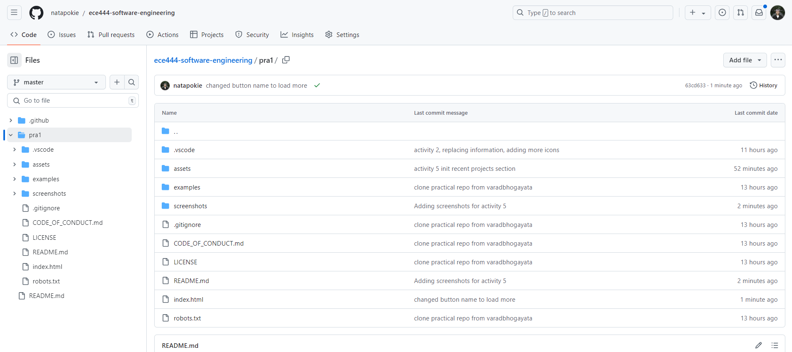

# PRA1 Front-End Design (Natalie) ⚡️

This repo is a clone of [varadbhogayata.github.io](https://github.com/varadbhogayata/varadbhogayata.github.io).

## Activity 1: Cloning personal website repo into your own GitHub account

_Screenshot of repo_

## Activity 2

_Screenshot of repo_

_Screenshot of deployed website_

## Activity 3

_Screenshot of repo_

_Screenshot of new theme_

## Activity 4

_Screenshot of repo_

_Screenshot of embedded map_

## Activity 5

_Screenshot of repo_

_Screenshot of recent project_

_Screenshot of all projects_