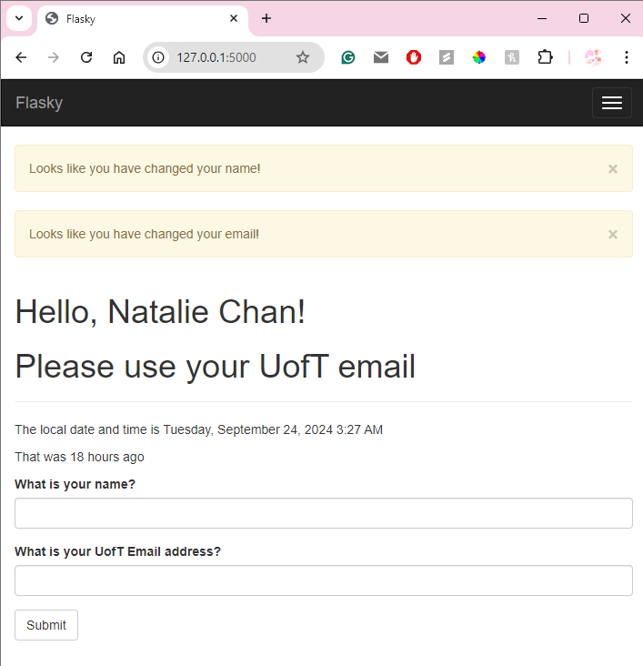

# PRA2 Flask Web Development & Docker (Natalie)


This repo is a clone of [https://github.com/miguelgrinberg/flasky](https://github.com/miguelgrinberg/flasky).

### Python Setup
```bash
# install python3-venv package
sudo apt-get install python3-venv

# create a virtual environment named venv
python3 -m venv venv

# activate the virtual environment
source venv/bin/activate

# install relevant packages using pip
pip install -r requirements.txt
```

### Running the Flask App hello.py
```bash
export FLASK_APP=hello.py
flask run
```

## Activity 1.4 Chapter 4 Example



_Screenshot of flash after modifying name and email, and entering a non-uoft email_

## Activity 2 Docker 

[Reference for Docker Build](https://www.cherryservers.com/blog/docker-build-command)

```bash
# build img from pra2 root folder, tagged with sample app, "latest" version
# when running commands from venv, use -p to specify port
docker build -t pra2:latest .
docker run -p <host_port>:<container_port> <image_name>
docker run -d -p 9999:5000 pra2

# note: to run interactive bash shell
docker run -it pra2:latest /bin/sh
```

--------------------------------------------

This repository contains the source code examples for the second edition of my O'Reilly book [Flask Web Development](http://www.flaskbook.com).

The commits and tags in this repository were carefully created to match the sequence in which concepts are presented in the book. Please read the section titled "How to Work with the Example Code" in the book's preface for instructions.

For Readers of the First Edition of the Book
--------------------------------------------

The code examples for the first edition of the book were moved to a different repository: [https://github.com/miguelgrinberg/flasky-first-edition](https://github.com/miguelgrinberg/flasky-first-edition).
