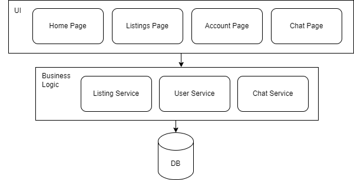

# PRA 4 Architecture Design

## Activity 1: Microservices

_Figure 1. Microservices Architecture of Campus Connect_

**User Service**: Handles user account management, authentication, and maintaining user profiles (listings, reviews, feedback). This service would have APIs for creating user accounts, logging in/getting user data and authentication.

**Listing Service**: Manages product listings including details like name, price, category, condition (new/used), images, and availability. This services has APIs for creating, updating, deleting and querying listings (filtering by string or specific categories).

**Chat Service**: Facilitates communication between buyers and sellers within the platform. Chat service would have APIs to send and recieve messages.

**API Gateway** is used to route requests from the client to the appropriate microservice.

Database for each Microservice: Each microservice has it's own data base. 
- User service would most likely use a relational database for user data
- Listing service would use a relational database for listing metadata and a blob storage database for images
- Chat service would likely be non relational storing conversations

## Activity 2: Monolithic

_Figure 1. Monolithic Architecture of Campus Connect_

In the monolithic design, we're following the three layers: UI, Business Logic and Data Access layers.

The UI layer contains all the pages and shared components (such as navbar, cards for listings and categories).

The Business Logic layer handles the three services mentioned in Activity 1, user service, listing service and chat service.

In the Data Access layer, there is a single shared database that stores all data related to users, listings and chat messages. This single database is used to handle all queries.

## Activity 3: Comparison

The quality requirement used for comparison is **performance**, filter listings results (either by string search or categories) must be returned in 1s.

Case to consider: if many users are on the app at once (e.g., during high traffic times, maybe school has just started and everyone is looking for second hand items).

For a monolithic architecture, all these queries will be handled by the same shared database, which will probably lead to latency and slower response times. Additionally, there is a single point of failure, if there's a bug with a query, that one failure could bring down the entire system or too many users can also overload the server. If we want to scale the application up to allow for increased traffic, the entire application must be scaled which would be costly.

For microservices, we can easily scale up the services independently, so only scaling up the listings service to handle more queries along with serparate databases and caching layers for higher performance and speed. However, with microservices, we also have to consider overhead complexity the requires more focus on infrastructure  during intitial development.

